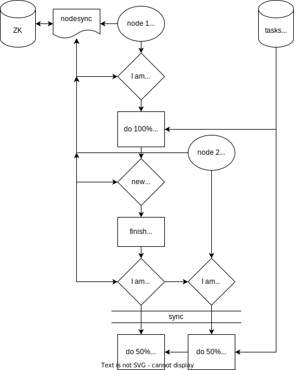

# node setup

The nodes-sync library uses zookeeper and helps to manage a clustered app. It can be useful to manage the load across
multiple nodes and dynamically scale it in real time when node fail or a new one become available.

## load spreading example

